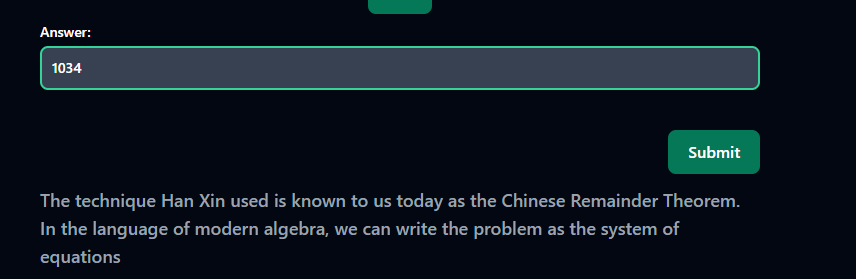

Description: Everybody!! Sunzi's math class is about to begin!!!   
Author: Wednesday   
Link: https://crypto-sunzi-perfect-math-class-6c3d583b3a73.2024.ductf.dev   

#Sun Zi's Perfect Math Class
In 200 BC, the Chinese general Han Xin marched into battle with 1500 soldiers. Afterwards, he could estimate that between 1000 and 1100 of them survived the battle, but needed to know exactly how many men he had.   

At that moment, Han Xin's steward came up to his side and said
> When the soldiers stand 3 in a row, there are 2 soldiers left over. When they line up 5 in a row, there are 4 soldiers left over. When they line up 7 in a row, there are 5 soldiers left over.

Upon hearing this, Han Xin knew immediately how many soldiers he had remaining.

## Steps: 
- Using the Chinese Remainder Theorem N is = 1034 for how many soldiers Han Xin has left.

