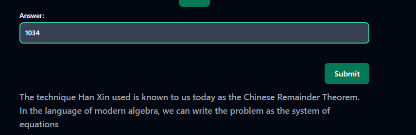

Description: Everybody!! Sunzi's math class is about to begin!!!   
Author: Wednesday   
Link: https://crypto-sunzi-perfect-math-class-6c3d583b3a73.2024.ductf.dev   

# Sun Zi's Perfect Math Class
In 200 BC, the Chinese general Han Xin marched into battle with 1500 soldiers. Afterwards, he could estimate that between 1000 and 1100 of them survived the battle, but needed to know exactly how many men he had.   

At that moment, Han Xin's steward came up to his side and said
> When the soldiers stand 3 in a row, there are 2 soldiers left over. When they line up 5 in a row, there are 4 soldiers left over. When they line up 7 in a row, there are 5 soldiers left over.

Upon hearing this, Han Xin knew immediately how many soldiers he had remaining.


## Steps: 
- 1) Using the Chinese Remainder Theorem N is = 1034 for how many soldiers Han Xin has left.

- 2) RSA mathematics C = M^e (mod N) we need to find the hidden message m in the equation c = m^e (mod n)
  > c1 = m^e (mod n1)   
  > c2 = m^e (mod n2)   
  > c3 = m^e (mod n3)   

   **Values:**
   > e = 3
   >    
   > c_1 = 105001824161664003599422656864176455171381720653815905925856548632486703162518989165039084097502312226864233302621924809266126953771761669365659646250634187967109683742983039295269237675751525196938138071285014551966913785883051544245059293702943821571213612968127810604163575545004589035344590577094378024637
   >    
   > c_2 = 31631442837619174301627703920800905351561747632091670091370206898569727230073839052473051336225502632628636256671728802750596833679629890303700500900722642779064628589492559614751281751964622696427520120657753178654351971238020964729065716984136077048928869596095134253387969208375978930557763221971977878737
   >
   > c_3 = 64864977037231624991423831965394304787965838591735479931470076118956460041888044329021534008265748308238833071879576193558419510910272917201870797698253331425756509041685848066195410586013190421426307862029999566951239891512032198024716311786896333047799598891440799810584167402219122283692655717691362258659
   >
   > n_1 = 147896270072551360195753454363282299426062485174745759351211846489928910241753224819735285744845837638083944350358908785909584262132415921461693027899236186075383010852224067091477810924118719861660629389172820727449033189259975221664580227157731435894163917841980802021068840549853299166437257181072372761693
   >
   > n_2 = 95979365485314068430194308015982074476106529222534317931594712046922760584774363858267995698339417335986543347292707495833182921439398983540425004105990583813113065124836795470760324876649225576921655233346630422669551713602423987793822459296761403456611062240111812805323779302474406733327110287422659815403
   >
   > n_3 = 95649308318281674792416471616635514342255502211688462925255401503618542159533496090638947784818456347896833168508179425853277740290242297445486511810651365722908240687732315319340403048931123530435501371881740859335793804194315675972192649001074378934213623075830325229416830786633930007188095897620439987817

  To make this easier to solve and not perform each calculation by hand we can use sympy.crt() method to get C.
  - For each value except for e create an variable for example: c3 = int("64864977037231624991423831965394304787965838591735479931470076118956460041888044329021534008265748308238833071879576193558419510910272917201870797698253331425756509041685848066195410586013190421426307862029999566951239891512032198024716311786896333047799598891440799810584167402219122283692655717691362258659")
   
  - After we can use crt function: C, _ = crt([n1, n2, n3], [c1, c2, c3]) where we can get C in the equation c = m^e (mod n). Using _ because the second value returned by crt is modulus which we don't need to calculate m.
  - We have the value for C and the exponent. We can rearrange the RSA decryption equation from c = m^e (mod N) to get C by using the equation:  ∛C = m

  - Output: 
  ```
   011564025922867522871782912815123211630478650327759091593792994457296772521676766420142199669845768991886967888274582504750347133
  ```
  

## Flag:   
```
DUCTF{btw_y0u_c4n_als0_us3_CRT_f0r_p4rt14l_fr4ct10ns}
```
## Step 2 Code:
```
from sympy.ntheory.modular import crt   
import gmpy2   
   
c1 = int("105001824161664003599422656864176455171381720653815905925856548632486703162518989165039084097502312226864233302621924809266126953771761669365659646250634187967109683742983039295269237675751525196938138071285014551966913785883051544245059293702943821571213612968127810604163575545004589035344590577094378024637")   
c2 = int("31631442837619174301627703920800905351561747632091670091370206898569727230073839052473051336225502632628636256671728802750596833679629890303700500900722642779064628589492559614751281751964622696427520120657753178654351971238020964729065716984136077048928869596095134253387969208375978930557763221971977878737")
c3 = int("64864977037231624991423831965394304787965838591735479931470076118956460041888044329021534008265748308238833071879576193558419510910272917201870797698253331425756509041685848066195410586013190421426307862029999566951239891512032198024716311786896333047799598891440799810584167402219122283692655717691362258659")

n1 = int("147896270072551360195753454363282299426062485174745759351211846489928910241753224819735285744845837638083944350358908785909584262132415921461693027899236186075383010852224067091477810924118719861660629389172820727449033189259975221664580227157731435894163917841980802021068840549853299166437257181072372761693")
n2 = int("95979365485314068430194308015982074476106529222534317931594712046922760584774363858267995698339417335986543347292707495833182921439398983540425004105990583813113065124836795470760324876649225576921655233346630422669551713602423987793822459296761403456611062240111812805323779302474406733327110287422659815403")
n3 = int("95649308318281674792416471616635514342255502211688462925255401503618542159533496090638947784818456347896833168508179425853277740290242297445486511810651365722908240687732315319340403048931123530435501371881740859335793804194315675972192649001074378934213623075830325229416830786633930007188095897620439987817")

C, _ = crt([n1, n2, n3], [c1, c2, c3])

m = gmpy2.iroot(C, 3)[0]

print(m)
```
  
  
