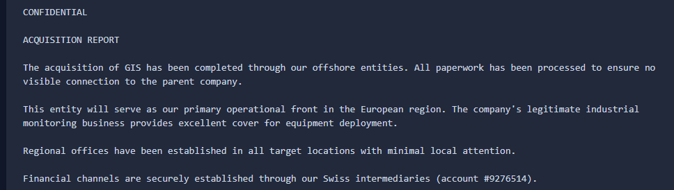
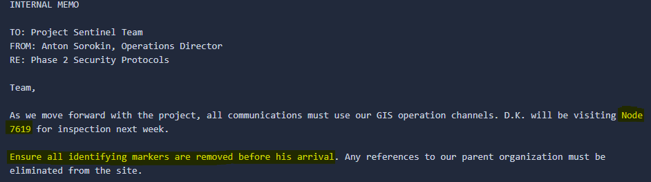
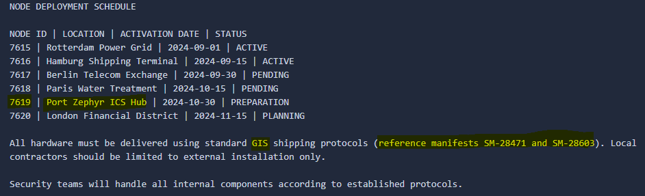
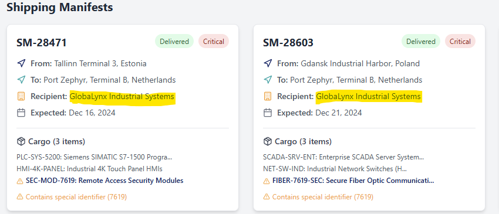

**Description:**   
Recent attacks on critical infrastructure across three European cities have been linked to a sophisticated threat actor dubbed "SVIR" (Special Volnaya Intelligence Regiment). Intelligence suggests that Volnaya Corporation, a multinational conglomerate with legitimate operations, is secretly orchestrating these attacks through a network of shell companies and contractors. Your task is to identify the shell company being used by Volnaya Corporation to procure and deploy specialized Industrial Control System (ICS) components for their operation. For more information about the mission, please download the briefing. Submit findings in the format: HTB{IDENTIFIED_SHELL_COMPANY_NAME_FRONT} Example: HTB{TECHNOSOFT_SOLUTIONS_LIMITED_FRONT} Note: The flag uses only uppercase letters, numbers, and underscores.

**HTB Difficulty Rating:** Very easy   
**How it felt:** Easy   
Docker IPs provided:   
```
83.136.255.39:48757 -> HTB DomainIntel
83.136.255.39:55027 -> HTB LeakedDocs
83.136.255.39:39461 -> HTB CorpNewsVault
83.136.255.39:54627 -> HTB GlobalShipDB
```

# Solve
## LeakedDocs
In LeakedDocs, 3 major leaked documents revealed the shell company.   
1) GIS Business Acquisition Report - Acquired GIS to serve as the primary front to cover equipment deployment due to GIS's previous legitimate history.   

2) Project Sentinel Internal Memo - Message to the Project Sentinel Team to remove all identifying markers on Node 7619 before inspection.   

3) Node Deployment Schedule - List the location of the Node delivery and the GIS-related manifests.   


## Shipping Dashboard
In both Manifest (SM-28471 & SM-28603), the recipient is GlobaLynx Industrial Systems, which can be abbreviated to GIS. In their notes are used for Project Sentinel Phase 1 and 2.   


# 🏁 Flag 🏁
HTB{GLOBALYNX_INDUSTRIAL_SYSTEMS_FRONT}
