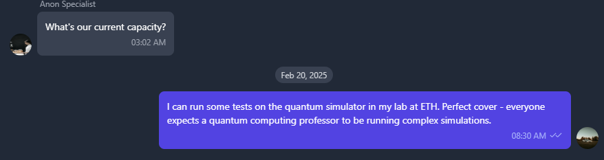
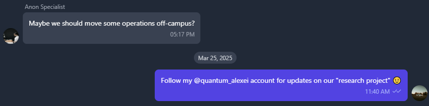
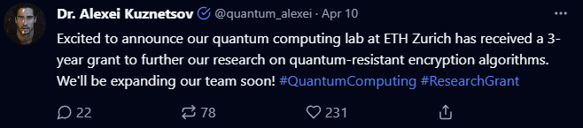

**Description:**    
Following the discovery of the front company and identifying main bank account as the financial hub, we now focus on the human element. Intelligence suggests the ShadowTalk platform, a dark web forum used by Volnaya operatives, is managed by an academic with quantum computing expertise. Your task is to identify the person behind ShadowTalk by analyzing their communications and social media presence, uncovering OPSEC failures that reveal their true identity. For more information about the mission, please download the briefing. Submit findings in the format: HTB{PERSON_TITLE_NAME_SURNAME_OCCUPATION} Example: HTB{DR_LOVE_SMITH_STRING_RESEARCHER} Note: The flag uses only uppercase letters, numbers, and underscores.

**HTB Difficulty Rating:** Easy   
**How it felt:** Really easy   

**Docker IPs provided:**   
```
94.237.120.228:38003 -> HTB GlobalScience Rsearch DB
94.237.120.228:31231 -> HTB SecureChat
94.237.120.228:50837 -> HTB ShadowTalk
94.237.120.228:52483 -> HTB Twitter clone
```
# Solve
The target works at ETH and is a quantum researcher and professor. Additionally, they're also using company resources for personal projects.   
   
Revealed a Twitter account with the name Alexei in it and talks about an update on their research project.

On Twitter clone @quantum_alexei is named Dr. Alexei Kuznetsov.   
   
# 🏁 Flag 🏁   
HTB{DR_ALEXEI_KUZNETSOV_QUANTUM_RESEARCHER}
