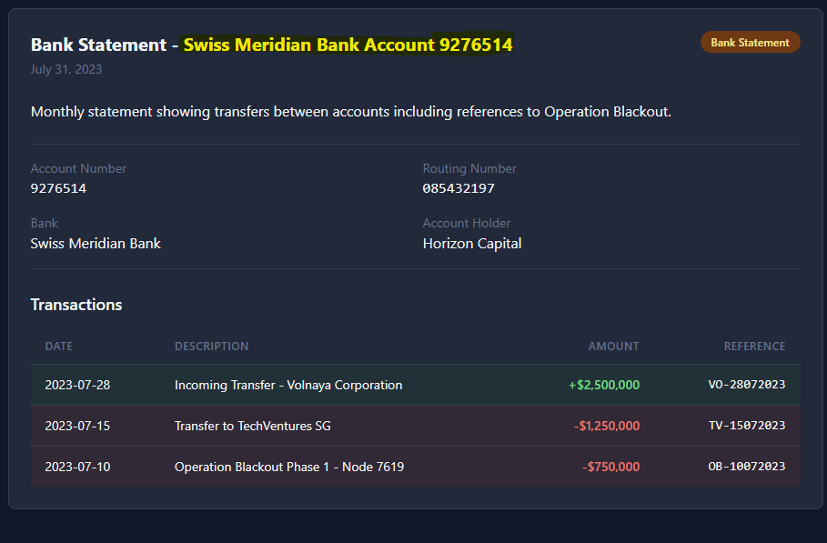

**Description:**  
Following the identification of a front company for Volnaya Corporation, intelligence indicates they've established a complex financial network to fund Operation Blackout. A specific bank account serves as the central hub for these operations. Your task is to trace the money flow through offshore entities and identify the specific bank account used to finance Volnaya's clandestine activities. For more information about the mission, please download the briefing. Submit findings in the format: HTB{BANK_NAME_ACCT_NUMBER} Example: HTB{GLOBAL_TRUST_BANK_ACCT_5241897} Note: The flag uses only uppercase letters, numbers, and underscores.

**HTB Rating:** Easy   
**How it felt:** Very Easy

**Docker IPs provided:**   
```
94.237.48.12:57930 -> HTB backtrace Explorer
94.237.48.12:31815 -> HTB Corporate Ownership Trade DB
94.237.48.12:50322 -> HTB FinDocs Archive
94.237.48.12:55346 -> Offshore Registry Search
```
# Solve
In FinDocs Archive is a bank statement for an account that received money from Volnaya Corp and paid TechVenture and Operation Blackout phase 1.   
Bank: Swiss Meridian Bank   
Account #: 9276514   


# 🏁 Flag 🏁   
HTB{SWISS_MERIDIAN_BANK_ACCT_9276514}
